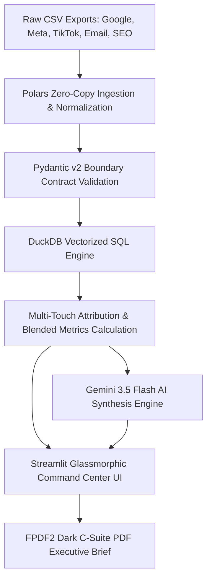

<p align="center">
  
</p>

# ⚡ MARKETING ROI ENGINE: Enterprise B2B Multi-Touch Attribution & Budget Optimization Engine

<p align="left">
  <a href="https://github.com/Ali-datasmith/Marketing-ROI-Tracker/actions/workflows/ci.yml"></a>
  <a href="https://github.com/Ali-datasmith/Marketing-ROI-Tracker/actions/workflows/codeql-analysis.yml"></a>
  
  
  
  
  
</p>

---

## 🎬 System Architecture & Live Command Center Demo

https://github.com/user-attachments/assets/35a9fc99-4807-461f-a499-1afe829953cb

---

```
====================================================================================================
                        MARKETING ROI & MULTI-TOUCH ATTRIBUTION COMMAND CENTER
====================================================================================================
[ Ingestion: Polars ] ---> [ Modeling: DuckDB SQL ] ---> [ AI Synthesis: Gemini 3.5 ] ---> [ Executive UI ]
====================================================================================================
```

---

## 1. Executive Summary & System Overview

**MARKETING ROI ENGINE (v2.0 Enterprise Edition)** is a production-grade B2B Multi-Touch Attribution (MTA) & Budget Optimization Engine. Engineered to transform fragmented multi-channel marketing data into executive revenue intelligence, the platform normalizes raw exports from Google Ads, Meta Ads, TikTok Ads, Email Marketing, and Organic SEO into unified, audit-ready data contracts.

### Core System Pillars
- **Zero-Copy Data Ingestion**: High-throughput Polars CSV parser featuring dynamic platform signature detection, date standardization, and monetary string coercion.
- **Vectorized In-Memory SQL Analytics**: In-memory DuckDB analytical engine executing window functions to calculate First-Touch, Last-Touch, Linear, and Time-Decay attribution models alongside Blended CAC, CPA, and ROAS.
- **Resilient Structured AI Synthesis**: `google-genai` client targeting `gemini-3.5-flash` with native Pydantic schema validation (`MarketingInsightsReport`), `httpx` timeout limits, and `tenacity` exponential backoff retries.
- **Argon2id Auth & Sandbox Gate**: Secure Argon2id password hashing paired with a 1-click **Recruiter Demo Access** bypass for instant read-only evaluation.
- **Glassmorphic Command Center**: Dark Streamlit presentation layer (`#0B0F19` background, `#00E5FF` cyan glow accents), Plotly model comparison charts, diminishing-returns budget simulator, and FPDF2 executive C-suite PDF report exporter.

## 2. End-to-End System Architecture



```
+-----------------------------------------------------------------------------------+
|                            MULTI-PLATFORM AD SPEND EXPORTS                        |
|    (Google Ads CSV | Meta Ads CSV | TikTok Ads CSV | Email CSV | Organic SEO CSV)   |
+-----------------------------------------------------------------------------------+
                                         |
                                         v
+-----------------------------------------------------------------------------------+
|                        POLARS ZERO-COPY INGESTION PIPELINE                        |
|   - Auto-detection of platform signatures (Google, Meta, TikTok, Email, SEO)      |
|   - Fast multi-format date parsing (%Y-%m-%d, %m/%d/%Y, %d-%b-%Y, etc.)           |
|   - Currency string normalization & coercion                                      |
|   - Pydantic v2 Contract Validation (`StandardAdRecord`)                          |
+-----------------------------------------------------------------------------------+
                                         |
                                         v
+-----------------------------------------------------------------------------------+
|                         DUCKDB VECTORIZED SQL ANALYTICS ENGINE                    |
|   - Blended CAC, ROAS, CPA, & Conversion Rate aggregation                         |
|   - Window Function Multi-Touch Models (First-Touch, Last-Touch, Linear, Time-Decay)|
+-----------------------------------------------------------------------------------+
                                         |
                       +-----------------+-----------------+
                       |                                   |
                       v                                   v
+----------------------------------------+ +----------------------------------------+
|    GEMINI 3.5 FLASH + RESILIENCE      | |       STREAMLIT COMMAND CENTER UI      |
|  - httpx timeout + tenacity retries    | |  - Emergent glassmorphic dark theme   |
|  - Pydantic v2 structured JSON output  | |  - Argon2 auth + 1-Click Recruiter Demo |
|  - Status-code-first error taxonomy    | |  - Interactive Budget Simulator        |
+----------------------------------------+ +----------------------------------------+
                       |                                   |
                       +-----------------+-----------------+
                                         |
                                         v
+-----------------------------------------------------------------------------------+
|                     FPDF2 DARK C-SUITE PDF EXECUTIVE BRIEF                        |
+-----------------------------------------------------------------------------------+
```

---

## 3. Multi-Touch Attribution Models

The DuckDB SQL engine executes four distinct mathematical attribution models across marketing touchpoints:

| Model | Formula / Logic | Business Evaluation Use Case |
| :--- | :--- | :--- |
| **First-Touch** | Attributes 100% conversion value strictly to initial touchpoint (`DENSE_RANK() OVER (ORDER BY first_seen ASC)` or `MIN(date)`) | Evaluating top-of-funnel acquisition, organic brand discovery, and lead generation efficiency. |
| **Last-Touch** | Attributes 100% conversion value strictly to final touchpoint (`DENSE_RANK() OVER (ORDER BY last_seen DESC)` or `MAX(date)`) | Measuring direct closing channels, retargeting performance, and bottom-of-funnel urgency. |
| **Linear** | Distributes revenue credit evenly across all touched channels (`SUM(revenue / total_touches)` or `1 / N`) | Evaluating full-cycle buyer journeys across multi-month enterprise B2B sales cycles. |
| **Time-Decay** | Applies exponential decay weighting (`0.85 ^ days_before_conversion`) favoring recent interactions | Ideal for weighting recent sales interactions while maintaining historical touchpoint credit. |

---

## 4. Key Technical Highlights

- **Pydantic v2 Data Boundary Contracts**: All ingestion pipelines validate output against `StandardAdRecord` and `UnifiedAdDataset` models enforcing strict types, positive monetary constraints, and non-empty channel strings.
- **Resilient AI Synthesis Pipeline**: Uses `tenacity` exponential backoff (`wait_exponential(min=2, max=10)`, `stop_after_attempt(3)`) to retry transient network and 429 rate-limit errors during Gemini API calls.
- **Status-Code Error Taxonomy**: Maps API and validation errors to explicit error categories (`CAT_QUOTA`, `CAT_AUTH`, `CAT_TIMEOUT`, `CAT_SCHEMA`) with automatic fallback to deterministic mock reports when unauthenticated.
- **Argon2id Password Security**: Uses `argon2-cffi` for password hashing and verification, protecting executive features while providing an isolated sandbox mode for recruiters.
- **PDF Executive Brief Exporter**: Custom `FPDF2` generator producing dark-themed C-suite briefs with header accents, KPI blocks, and AI recommendations.

---

## 5. Directory Structure

```
Marketing-ROI-Tracker/
├── .devcontainer/
│   └── devcontainer.json          # DevContainer configuration (Python 3.12 Bookworm)
├── .github/
│   └── workflows/
│       ├── ci.yml                 # Node 22 LTS + Python 3.12/3.13 matrix runner
│       └── codeql-analysis.yml    # CodeQL Security SAST static analysis
├── src/
│   ├── schemas/
│   │   ├── __init__.py
│   │   └── ad_platforms.py        # Pydantic v2 boundary models (StandardAdRecord)
│   ├── engine/
│   │   ├── __init__.py
│   │   ├── ingestion.py           # Polars zero-copy CSV parsing & platform detector
│   │   └── attribution.py         # DuckDB SQL vectorized MTA window functions
│   ├── ai/
│   │   ├── __init__.py
│   │   └── insights_engine.py     # Gemini 3.5 Flash client with httpx & tenacity resilience
│   ├── auth/
│   │   ├── __init__.py
│   │   └── security.py            # Argon2id password hashing & Recruiter Demo permissions
│   ├── reporting/
│   │   ├── __init__.py
│   │   └── pdf_generator.py       # FPDF2 dark-themed executive brief generator
│   └── ui/
│       ├── __init__.py
│       ├── styles.py              # Emergent glassmorphic CSS theme
│       └── components.py          # Plotly MTA charts & budget simulator
├── tests/
│   ├── __init__.py
│   ├── test_schemas.py            # Pydantic contract unit tests
│   ├── test_ingestion.py          # Polars ingestion & platform signature tests
│   ├── test_attribution.py        # DuckDB SQL attribution model tests
│   ├── test_security_reporting.py # Argon2 auth, AI fallback, & FPDF2 tests
│   └── test_math_and_pdf.py       # End-to-end data parity & math verification tests
├── data/                          # Enterprise sample CSV datasets
├── app.py                         # Streamlit presentation layer & entrypoint
├── pyproject.toml                 # Ruff, Mypy, and Pytest configuration
├── requirements.txt               # Production Python dependencies
└── README.md                      # Architecture & operational documentation
```

---

## 6. Local Setup & Execution Guide

### 1. Prerequisites
- **Python**: 3.12 or 3.13
- **Git**

### 2. Virtual Environment Setup
```bash
# Clone the repository
git clone https://github.com/Ali-datasmith/Marketing-ROI-Tracker.git
cd Marketing-ROI-Tracker

# Create virtual environment
python3 -m venv venv
source venv/bin/activate  # On Windows: venv\Scripts\activate

# Install production dependencies
pip install -r requirements.txt
```

### 3. Launch Local Development Server
```bash
streamlit run app.py
```
Open [http://localhost:8501](http://localhost:8501) in your browser.

- **Recruiter Demo Access**: Click **"🚀 1-Click Recruiter Demo Access"** on the Executive Access Gate for immediate sandbox evaluation.
- **Admin Password**: Reads from `os.getenv("ADMIN_PASSWORD")` or falls back to default `MTA_Enterprise_2026!Secured#`.

---

## 7. Streamlit Community Cloud Deployment

This repository includes dynamic `sys.path` resolution for `src/` inside `app.py` for zero-configuration Streamlit Community Cloud deployment:

1. Push your repository to GitHub.
2. Sign in to [share.streamlit.io](https://share.streamlit.io).
3. Connect your repository with the following settings:
   - **Main file path**: `app.py`
   - **Python version**: `3.12`
4. *(Optional)* Add your Gemini API key in **Advanced Settings -> Secrets**:
   ```toml
   GEMINI_API_KEY = "your-actual-gemini-api-key"
   ADMIN_PASSWORD = "your-custom-admin-password"
   ```
5. Deploy!

---

## 8. Testing, Quality Gates & Security Scans

The codebase maintains strict quality standards verified via automated CI pipelines:

```bash
# Execute Pytest Unit Test Suite
pytest

# Execute Ruff Linter
ruff check .

# Execute Mypy Strict Type Checking
mypy src/ --ignore-missing-imports
```

---

## 9. System Limitations & Production Roadmap

### In-Memory Analytics Boundary
- **Current Architecture**: In-memory DuckDB and Polars engines process datasets locally on single-node Streamlit instances.
- **Production Roadmap**: For datasets exceeding multi-gigabyte RAM constraints, transition DuckDB table registration to external distributed analytics engines (e.g., Snowflake, Trino, or BigQuery).

### Rate Limit & Quota Resilience
- **Current Architecture**: The AI synthesis layer leverages `tenacity` exponential backoff retries for 429 rate limits and 5xx errors, defaulting to a deterministic mock report upon quota exhaustion.
- **Production Roadmap**: Implement a Redis-backed caching layer for generated executive reports to reduce redundant LLM calls across identical dataset states.

### Batch CSV vs. Real-Time CDC Streaming
- **Current Architecture**: Ingestion processes batch CSV exports from ad platform reporting portals.
- **Production Roadmap**: Implement real-time Change Data Capture (CDC) streaming via Apache Kafka or Webhooks connected directly to Google Ads and Meta Marketing APIs.

---

## 10. License

Distributed under the MIT License. See [`LICENSE`](https://github.com/Ali-datasmith/Marketing-ROI-Tracker/blob/main/LICENSE) for details.
